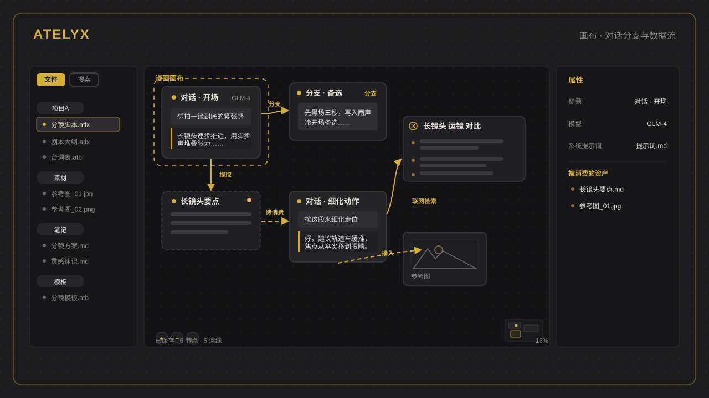

<div align="center" style="padding:4px 0 12px">

[English version →](docs/README_EN.md)

</div>

<div align="center" style="background:#17171a;border:1px solid #2a2a2e;border-radius:16px;padding:48px 24px 40px;margin:0 0 32px">


<h1 style="color:#E5E0D5;font-weight:700;letter-spacing:3px;margin:16px 0 10px">ATELYX</h1>

<p style="color:#D4AF37;font-size:17px;font-weight:600;margin:0 0 14px">把对话、笔记、表格、文件放进同一张可拓展的工作台——AI 辅助贯穿，多人实时协作</p>

<p style="color:#8b8b8b;max-width:660px;margin:0 auto 30px;font-size:15px;line-height:1.8">
Atelyx 是一款以人为本的可拓展桌面工作台：对话、笔记、表格、文件在同一工作台并排打开，也可拆成独立窗口；工作由人主导，AI 只做辅助；局域网多人实时协作，数据以普通文件存于本地仓库。插件平台让工作台能扩展出各种未预定义的形态——目标是探索 AI 时代协作与工作的新范式。
</p>

<span style="background:#D4AF37;color:#1C1C1E;border-radius:999px;padding:4px 18px;font-size:13px;font-weight:700;margin:0 4px">Windows</span>
<span style="border:1px solid #5a5a5e;color:#9a9a9e;border-radius:999px;padding:3px 17px;font-size:13px;font-weight:600;margin:0 4px">Linux · Wayland</span>
<span style="border:1px solid #5a5a5e;color:#9a9a9e;border-radius:999px;padding:3px 17px;font-size:13px;font-weight:600;margin:0 4px">Apache-2.0</span>

</div>

## 设计理念

平时工作需要在多个工具之间来回切换：写作用一个软件、表格用一个软件、沟通再切到聊天工具，每次切换都会打断思路。Atelyx 把常用场景放进同一张工作台：

<div style="border:1px solid #2a2a2e;border-left:3px solid #D4AF37;border-radius:8px;padding:14px 20px;margin:14px 0">

**01 · 一个工作台装下常用工作** — 对话、笔记、表格、文件、搜索在同一工作台并排打开；标签可停靠，面板可拆成独立窗口，布局自由组合。

**02 · AI 是辅助而不是独立工具** — AI 直接内嵌在对话、笔记、表格、文件与搜索场景里，不用切去某个 AI 工具；工作由人主导，AI 只做辅助——不是输入需求就全自动产出的生成器。

**03 · 素材可复用** — 搜索结果、提炼的段落、粘贴的素材会沉淀为可复用资产，可随时接入任意对话。

**04 · 局域网协作** — 多人实时互见：同编一篇笔记、同改一块画布、同看一张表格。谁在看什么、选中在哪里，一目了然。

**05 · 文件即仓库** — 没有数据库。画布、笔记、附件都是普通文件，可积累、可备份、可 Git 同步，也可被外部编辑器打开并实时同步回来。

</div>

## 画布 · 有向图对话

画布是工作台里的一个视图，用于处理对话分支：一场与 AI 的对话不必是一条单向时间线。分支变成画布上的节点，每个分支继承父链完整状态、独立演化，再多也能并排摆放、横向对比。

- **对话是有向图，不是聊天记录** — 分支即画布上的新节点；连线表达数据流（产出方 → 消费方）
- **连线即数据流** — 在输入框输入 `@` 提及，与从节点边框拉出一条线，是同一条边的两种操作；实线 = 已被消费、虚线 = 待消费
- **产物即节点** — 联网搜索的结果、粘贴的素材、对话中提炼的段落，都会自动沉淀为画布上的可复用资产

```
+------------+           +------------+
| 对话节点 A | --分支-->  | 对话节点 B |
+------+-----+           +------------+
       | 提取：段落拉出为文本节点
       v
+------------+
|  文本节点  |
+------+-----+
       | @ 提及 / 拉线引用（虚线 -> 实线）
       v
+------------+                 +-------------+
| 对话节点 C | --AI 自主联网--> | 搜索结果节点 |
+------+-----+                 +-------------+
       | 接入：媒体节点 / 表格节点
       v
  继续对话 / 再分支……
```

- **对话节点**：与 AI 的多轮对话，可流式输出、分支、拉线引用资产
- **文本节点**：从对话中提炼的段落，可编辑、可再接入任意对话作为提示词
- **媒体节点**：粘贴/拖拽的图片与文件，作为多模态附件注入对话
- **搜索结果节点**：AI 在对话中自主联网搜索的产物
- **表格节点**：仓库多维表格的引用，按字段名组装快照注入对话
- **分组 / 链接节点**：画布组织与外部 URL 卡片

## 核心能力

| | |
| --- | --- |
| **可停靠工作区 · 多窗口** | 标签组停靠 + 面板撕裂成独立窗口 + 跨面板拖拽组合；内置画布/笔记/表格三套布局；布局可命名保存、重启恢复；标签可锁定防止误触 |
| **画布 · 有向图对话** | 对话分支成为画布节点、连线表达数据流；文本/媒体/搜索/表格节点可复用接入对话 |
| **多人实时协作** | 局域网中转，在线成员实时互见（昵称/颜色/选中处高亮）；笔记 Yjs 实时协同 + 远端光标；画布节点/消息即时同步 + 对话独占锁 + 生成中指示灯；表格选中与内容实时互见 |
| **AI 对话与 Agent** | 流式输出、随时分支、思考过程折叠；推理等级与模型两级选择；仓库级 Agent 配置（系统提示词 + 工具）；模型供应商多模型管理、测试连通性、模型昵称 |
| **AI 读写与联网** | Agent 工具：联网搜索、抓取网页、读取/查找/搜索内容/写入/编辑仓库文件 |
| **笔记编辑器** | 实时预览编辑；frontmatter 属性内联编辑；双链 + 缺失链接快捷新建；反链自动发现；划词 AI 改写；多人协作 |
| **多维表格** | 类型化字段与多图单元格；时间线视图 + 预演播放；AI 辅助填行；列宽/行高自适应；撤销/重做；xlsx 导出 |
| **历史记录与回滚** | 画布/笔记/表格版本列表、人话摘要、变更 diff、一键回滚 |
| **文件化仓库** | 无数据库、全文件存储；笔记可被外部编辑器打开并实时同步；重命名联动全仓库引用与内部链接；排除文件夹/附件文件夹可配置 |
| **联网 + 仓库搜索** | 联网搜索（Tavily / 自建 SearXNG）；仓库内文件查找 + 全文搜索；搜索结果沉淀为节点 |

## 界面示意

<div align="center">




</div>

## 安装

从 [GitHub Releases](https://github.com/Atelyx/Atelyx/releases) 下载对应平台安装包：

| 平台 | 安装包 |
| --- | --- |
| Windows 10/11（x64） | `.msi` / `.exe` |
| Linux（Wayland 原生，兼容 X11） | 源码构建 |

或从源码构建：

```bash
pnpm install         # 安装前端依赖
pnpm run tauri:dev   # 启动开发（自动开 Vite + Tauri 窗口）
pnpm run tauri:build # 打包
```

前置要求：Node.js 18+、pnpm、Rust（stable）、Tauri 2 系统依赖（见 [Tauri 官方文档](https://v2.tauri.app/start/prerequisites/)）。

## 仓库文件一览

仓库 = 你自选的本地文件夹，没有数据库，一切以文件沉淀：

```
我的仓库/
├── .atelyx/        仓库级配置（隐藏目录：config / agents / prompt-notes / 对话历史 / history；API key 不落盘）
├── 项目A/
│   ├── 画布.atlx   画布文件（一个画布一个 JSON）
│   ├── 表格.atb    多维表格文件
│   ├── 提示词.md   笔记（可被外部编辑器打开）
│   └── 素材/       附件（图片 / 文件）
└── 直接放根目录.md  根目录文件同样支持
```

- `.atlx` / `.md` / 附件按扩展名识别，可位于任意文件夹（含根目录）
- 文本与媒体节点只存路径引用，内容在独立文件——可跨画布共享、删画布不删文件
- 外部编辑 `.md` / 附件 / 画布，实时同步回应用

## 开发命令

```bash
pnpm run dev        # Vite 开发服务器
pnpm run check      # 完整门禁：vendor 构建 + 类型检查 + ESLint + 前端测试 + cargo test
pnpm run format     # Prettier 格式化
pnpm run tauri:dev  # 启动开发（自动开 Vite + Tauri 窗口）
pnpm run tauri:build # 打包
```

## 隐私与安全

- **API key 默认仅存系统 keychain**（按仓库隔离），不落仓库文件、不进日志；可选「随仓库保存」以支持多设备同步
- **多人协作仅限局域网中转**：经自建中转服务实时互见，无云端同步；中转地址与身份（昵称/颜色）由用户配置
- Markdown 渲染禁用原始 HTML（防 XSS）；仓库文件读写做路径校验（限制在仓库根内）
- 自动更新安装包带签名校验，校验失败拒绝安装

## 参与贡献

- 提 Bug / 需求：[Issues](https://github.com/Atelyx/Atelyx/issues)
- 提交 Pull Request：请先阅读 [贡献准则](docs/CONTRIBUTING.md)

## License

[Apache-2.0](LICENSE)
